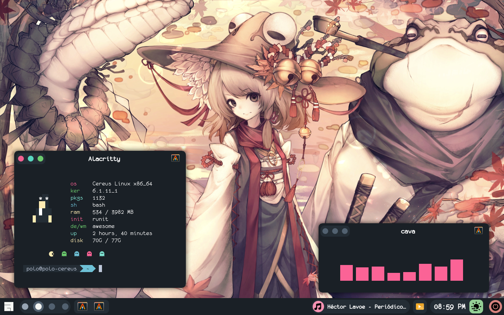

# Mis dotfiles para awesome wm 

Algunos dotfiles cool que uso para mi entorno en awesome

## Requisitos:

Programas (Se encuentra en la mayoria de repositorios ;D
 * Alacritty (Terminal.)
 * Rofi (Lanzador.)
 * Awesome (Administrador de ventana.)
 
Fuentes
 * Monofur Nerd Font
 * Noto Sans CJK

## Instalar:

```
git clone https://github.com/poloz-z/dotfiles-awe
```

Y copiar el contenido de la carpeta en $HOME/.config

Firma pongcham~


